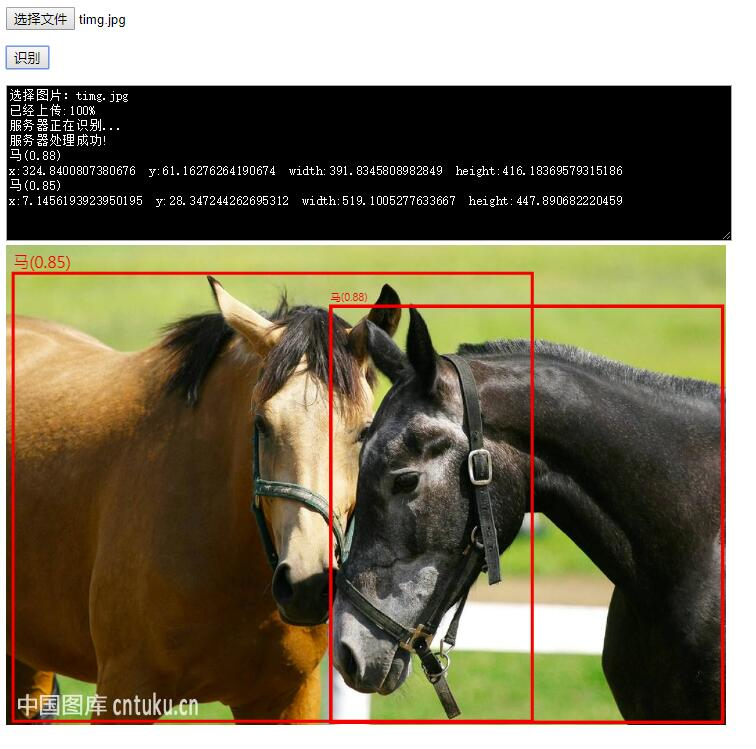

# Object_detection_server
Object detection as a service
<p align="center">
  
</p>


# Config
1. set <a href='https://github.com/tensorflow/models/blob/master/research/object_detection/g3doc/exporting_models.md' target='_blan' >pb</a> file path to ```PATH_TO_CKPT``` and pbtxt file path to ```PATH_TO_LABELS``` in ```odapi_server.py```
2. copy file: ```cp ./* /path/to/tensorflow/models/research/ -rf```
 
 
# Run 
```
python odapi.py
```


# Visit
http://127.0.0.1:5000
